# Execution Plan - 울프강 스테이크하우스 테이블오더

## Detailed Analysis Summary

### Change Impact Assessment
- **User-facing changes**: Yes — 고객 주문 UI + 관리자 대시보드 전체 신규 개발
- **Structural changes**: Yes — 전체 시스템 아키텍처 신규 설계 (모노레포, REST API, SSE)
- **Data model changes**: Yes — 9개 엔티티 신규 설계 (Store, Admin, Table, Category, MenuItem, TableSession, Order, OrderItem, OrderHistory)
- **API changes**: Yes — 전체 REST API 신규 설계
- **NFR impact**: Yes — 실시간 SSE, JWT 인증, 성능 요구사항

### Risk Assessment
- **Risk Level**: Medium (신규 프로젝트이나 잘 정의된 요구사항, 검증된 기술 스택)
- **Rollback Complexity**: Easy (Greenfield, 롤백 불필요)
- **Testing Complexity**: Moderate (SSE 실시간 통신, 세션 관리 테스트 필요)

---

## Workflow Visualization

```mermaid
flowchart TD
    Start(["User Request"])
    
    subgraph INCEPTION["🔵 INCEPTION PHASE"]
        WD["Workspace Detection<br/><b>COMPLETED</b>"]
        RA["Requirements Analysis<br/><b>COMPLETED</b>"]
        US["User Stories<br/><b>COMPLETED</b>"]
        WP["Workflow Planning<br/><b>COMPLETED</b>"]
        AD["Application Design<br/><b>EXECUTE</b>"]
        UG["Units Generation<br/><b>EXECUTE</b>"]
    end
    
    subgraph CONSTRUCTION["🟢 CONSTRUCTION PHASE"]
        FD["Functional Design<br/><b>EXECUTE</b>"]
        NFRA["NFR Requirements<br/><b>EXECUTE</b>"]
        NFRD["NFR Design<br/><b>EXECUTE</b>"]
        CG["Code Generation<br/><b>EXECUTE</b>"]
        BT["Build and Test<br/><b>EXECUTE</b>"]
    end
    
    Start --> WD
    WD --> RA
    RA --> US
    US --> WP
    WP --> AD
    AD --> UG
    UG --> FD
    FD --> NFRA
    NFRA --> NFRD
    NFRD --> CG
    CG --> BT
    BT --> End(["Complete"])
    
    style WD fill:#4CAF50,stroke:#1B5E20,stroke-width:3px,color:#fff
    style RA fill:#4CAF50,stroke:#1B5E20,stroke-width:3px,color:#fff
    style US fill:#4CAF50,stroke:#1B5E20,stroke-width:3px,color:#fff
    style WP fill:#4CAF50,stroke:#1B5E20,stroke-width:3px,color:#fff
    style AD fill:#FFA726,stroke:#E65100,stroke-width:3px,stroke-dasharray: 5 5,color:#000
    style UG fill:#FFA726,stroke:#E65100,stroke-width:3px,stroke-dasharray: 5 5,color:#000
    style FD fill:#FFA726,stroke:#E65100,stroke-width:3px,stroke-dasharray: 5 5,color:#000
    style NFRA fill:#FFA726,stroke:#E65100,stroke-width:3px,stroke-dasharray: 5 5,color:#000
    style NFRD fill:#FFA726,stroke:#E65100,stroke-width:3px,stroke-dasharray: 5 5,color:#000
    style CG fill:#4CAF50,stroke:#1B5E20,stroke-width:3px,color:#fff
    style BT fill:#4CAF50,stroke:#1B5E20,stroke-width:3px,color:#fff
    style Start fill:#CE93D8,stroke:#6A1B9A,stroke-width:3px,color:#000
    style End fill:#CE93D8,stroke:#6A1B9A,stroke-width:3px,color:#000
    style INCEPTION fill:#BBDEFB,stroke:#1565C0,stroke-width:3px,color:#000
    style CONSTRUCTION fill:#C8E6C9,stroke:#2E7D32,stroke-width:3px,color:#000
    
    linkStyle default stroke:#333,stroke-width:2px
```



### Text Alternative
```
Phase 1: INCEPTION
- Workspace Detection (COMPLETED)
- Requirements Analysis (COMPLETED)
- User Stories (COMPLETED)
- Workflow Planning (COMPLETED)
- Application Design (EXECUTE)
- Units Generation (EXECUTE)

Phase 2: CONSTRUCTION (per-unit)
- Functional Design (EXECUTE)
- NFR Requirements (EXECUTE)
- NFR Design (EXECUTE)
- Code Generation (EXECUTE)
- Build and Test (EXECUTE)
```

---

## Phases to Execute

### 🔵 INCEPTION PHASE
- [x] Workspace Detection (COMPLETED)
- [x] Requirements Analysis (COMPLETED)
- [x] User Stories (COMPLETED)
- [x] Workflow Planning (COMPLETED)
- [ ] Application Design - **EXECUTE**
  - **Rationale**: 신규 프로젝트로 컴포넌트 구조, 서비스 레이어, API 엔드포인트 설계 필요
- [ ] Units Generation - **EXECUTE**
  - **Rationale**: Backend + Frontend 두 개의 주요 유닛으로 분해하여 체계적 구현 필요

### 🟢 CONSTRUCTION PHASE (per-unit)
- [ ] Functional Design - **EXECUTE**
  - **Rationale**: 9개 엔티티의 데이터 모델, 비즈니스 로직, API 설계 필요
- [ ] NFR Requirements - **EXECUTE**
  - **Rationale**: SSE 실시간 통신, JWT 인증, 성능 요구사항 정의 필요
- [ ] NFR Design - **EXECUTE**
  - **Rationale**: NFR 패턴을 실제 설계에 반영 필요
- [ ] Infrastructure Design - **SKIP**
  - **Rationale**: 로컬/온프레미스 배포로 클라우드 인프라 설계 불필요. npm scripts로 빌드/실행 충분
- [ ] Code Generation - **EXECUTE** (ALWAYS)
  - **Rationale**: 전체 애플리케이션 코드 구현
- [ ] Build and Test - **EXECUTE** (ALWAYS)
  - **Rationale**: 빌드 및 테스트 검증

### 🟡 OPERATIONS PHASE
- [ ] Operations - PLACEHOLDER

---

## Extension Compliance
| Extension | Status | Rationale |
|---|---|---|
| Security Baseline | Disabled | 사용자가 Requirements Analysis에서 B (건너뛰기) 선택 |

---

## Success Criteria
- **Primary Goal**: 울프강 스테이크하우스 테이블오더 MVP 완성
- **Key Deliverables**:
  - 고객용 프리미엄 다크 테마 주문 웹 UI
  - 관리자용 실시간 주문 모니터링 대시보드
  - REST API + SSE 백엔드 서버
  - SQLite 데이터베이스 + 시드 데이터
  - 단위 테스트
- **Quality Gates**:
  - 모든 API 엔드포인트 정상 동작
  - SSE 실시간 주문 알림 2초 이내
  - 고객 주문 플로우 E2E 동작
  - 관리자 주문 관리 플로우 E2E 동작
